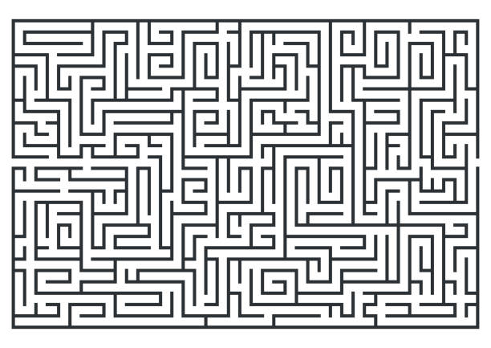
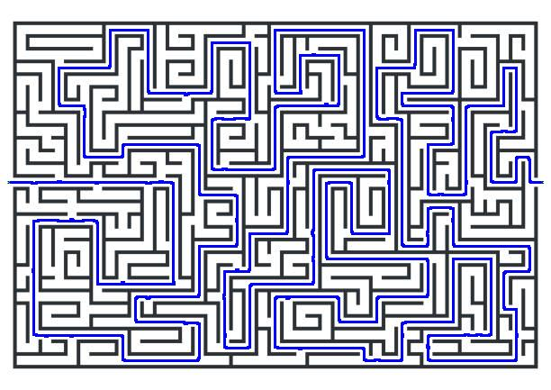
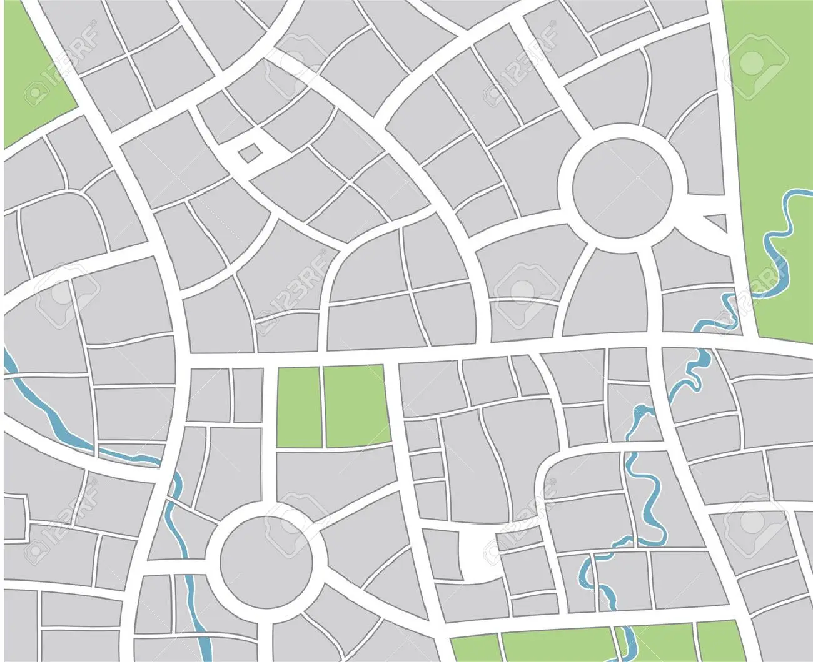

# LMRE-AI-Pathfinder

LMRE is a Python application that uses artificial intelligence to find the shortest path between two points in a given image. The image can be a maze, a street map, or any other type of network of 'paths'.

## Features

- The application can detect the nodes and edges in the image using OpenCV.
- The application can find an optimized path between two user-specified points using a custom depth-first algorithm that optimizes for both path length and time taken to find the path.
- The application can render the solution path onto the source image.

## Requirements

- Python 3.8 or higher
- OpenCV 4.5.3 or higher
- numpy 1.21.2 or higher
- matplotlib 3.4.3 or higher

## Usage

- Run the main.py file in the code directory using `python main.py`.
- Set the start and end coordinates in the code (an interface is not available yet, but in progress)
- Wait for the application to process the image and find the solution path.
- Check the output folder for the rendered image.

## Examples

Here are some examples of input images and output images:

Maze path from left to right

Street map path from top-left to bottom-right

